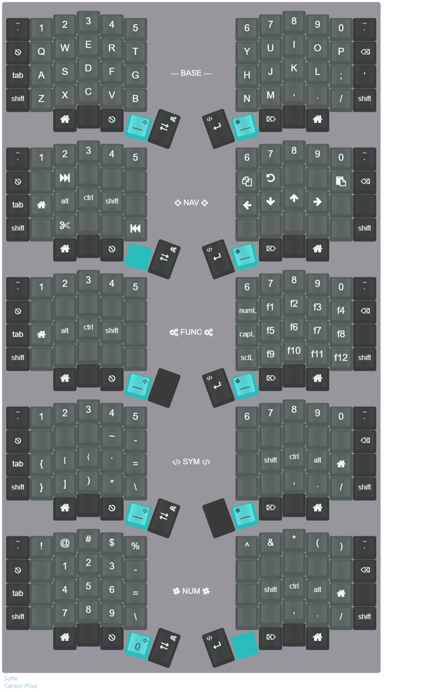

# cdprice02 keymap for Sofle Keyboard

<!--
To capture the above images from Keyboard Layout Editor paste the following script code snippet into the console of your web browser:
html2canvas($("#keyboard"), {
    onrendered: function(canvas) {
        canvas.toBlob(function(blob) {
            saveAs(blob, "layout.png");
        });
    }
});
-->

Layout in [Keyboard Layout Editor](https://www.keyboard-layout-editor.com/#/gists/bc57b68d8317ce4aacc1a9f36c816571).

## Features

- Homerow modifiers (CMD/Super, Alt/Opt, Ctrl, Shift)
- Various modes - can be switched by thumb keys (Base, Navigation, Functions, Symbols, Numbers)
- Modes for Mac vs Linux/Win support -> different order of modifiers and different action
- Display shows selected mode and state of lock keys (num, caps, and scroll lock)
- Left encoder controls volume up/down/mute; right encoder controls media fast-forward/rewind/pause
